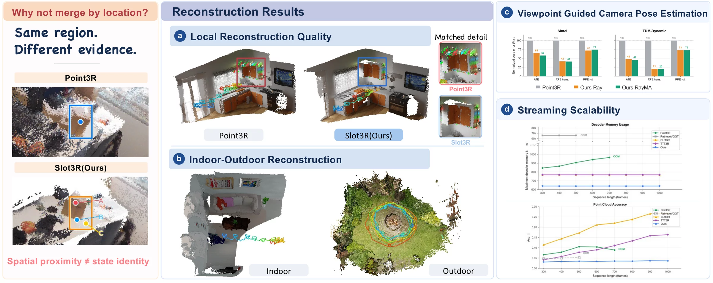
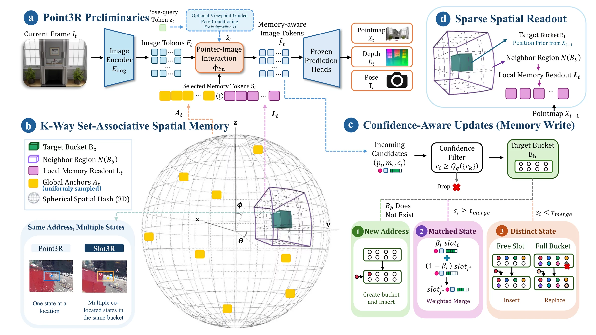
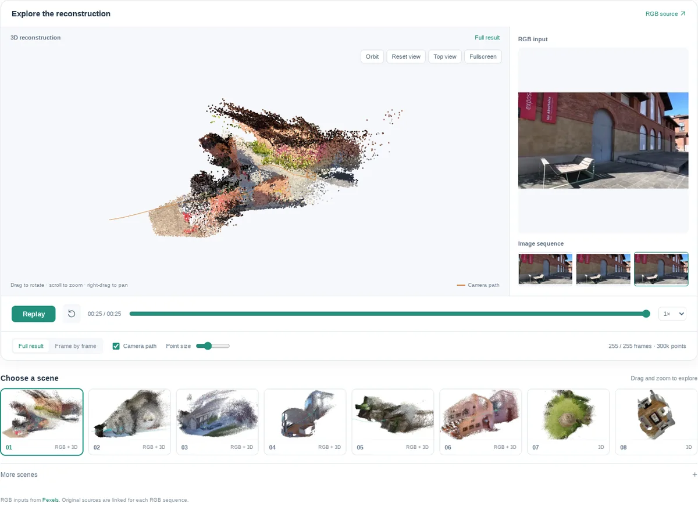

<div align="center">

<h2>Slot3R: Set-Associative Spatial Memory for Streaming 3D Reconstruction</h2>

<p>
  <a href="https://github.com/xyzhang-ashley">Xiyuan Zhang</a><sup>1,2*</sup> &nbsp;
  <a href="https://2hitee.github.io/">Yanming Yang</a><sup>1*</sup> &nbsp;
  <a href="https://github.com/chumo-xu">Kaiyuan Xu</a><sup>1</sup> &nbsp;
  <a href="https://scholar.google.com/citations?user=qtGY5T4AAAAJ&amp;hl=zh-CN">Ruibo Li</a><sup>3</sup> &nbsp;
  <a href="https://icoz69.github.io/">Chi Zhang</a><sup>1†</sup>
</p>

<p>
  <sup>1</sup> AGI Lab Westlake University &nbsp;·&nbsp;
  <sup>2</sup> University of Illinois Urbana-Champaign<br>
  <sup>3</sup> Nanyang Technological University
</p>

<p><sup>*</sup> Equal contribution &nbsp;·&nbsp; <sup>†</sup> Corresponding author</p>

<p>
  <a href="https://ashleyxyz.github.io/Slot-3R/"></a>&nbsp;
  <a href="https://arxiv.org/abs/2610.12282"></a>&nbsp;
  <a href="https://arxiv.org/pdf/2610.12282"></a>&nbsp;
  <a href="#demo"></a>
</p>

<p><b>Training-free streaming reconstruction · Multiple states per spatial address</b></p>

</div>

<p align="center">
  <a href="assets/teaser.webp"></a>
</p>

<p align="center">
  <a href="#overview">Overview</a> ·
  <a href="#method">Method</a> ·
  <a href="#demo">Demo</a> ·
  <a href="#installation">Installation</a> ·
  <a href="#quick-start">Quick start</a> ·
  <a href="#evaluation">Evaluation</a> ·
  <a href="#citation">Citation</a> ·
  <a href="#contact">Contact</a>
</p>

<a id="overview" name="overview"></a>

## ✨ Overview

**Slot3R** is a training-free method for streaming 3D reconstruction, built on [Point3R](https://github.com/YkiWu/Point3R). Its set-associative spatial memory preserves complementary surfaces, viewpoints and visibility conditions at the same address while keeping the pretrained backbone frozen.

- **Multiple states per address.** K-way memory retains distinct evidence within each spatial bucket.
- **Confidence-aware updates.** Incoming observations are filtered and matched before insertion, fusion or replacement.
- **Bounded decoder access.** Sparse readout combines local evidence with global anchors under a 640-token budget. Persistent storage grows with scene coverage.
- **Optional pose conditioning.** Two viewpoint-guided variants improve camera-pose estimation while retaining comparable reconstruction quality.

### Results at a glance

| Task | Result | Setting |
| :--- | :--- | :--- |
| Dense reconstruction | **57.1–63.1%** lower Acc error on 7Scenes; **64.0–72.0%** on NeuralRGBD | Core vs. Point3R, 300–500 sampled frames |
| Camera pose | **29.1–53.1%** lower Sim(3)-aligned ATE | VPC-A vs. Point3R, ScanNet / Sintel / TUM-Dynamic |
| Long streams | Completes **600–1,000 frames** at approximately **19 FPS** | Core, NVIDIA RTX 4090 |

<a id="method" name="method"></a>

## 🧩 Method

<p align="center">
  <a href="assets/pipeline.webp"></a>
</p>

<a id="demo" name="demo"></a>

## 🧊 Demo

<p align="center">
  <a href="https://ashleyxyz.github.io/Slot-3R/demos/"></a>
</p>

<p align="center"><a href="https://ashleyxyz.github.io/Slot-3R/demos/"><b>Open interactive 3D demo ↗</b></a></p>

<a id="installation" name="installation"></a>

## ⚙️ Installation

Use Linux, Python 3.11 and CUDA-enabled PyTorch. See the [installation guide](docs/installation.md) for details.

```bash
git clone https://github.com/xyzhang-ashley/Slot3R.git
cd Slot3R

conda create -n slot3r python=3.11 -y
conda activate slot3r

# Install a CUDA-enabled torch/torchvision pair for your machine first.
pip install -r requirements.txt

# Build the rotary-position-encoding extension.
(cd src/croco/models/curope && python setup.py build_ext --inplace)
```

**Checkpoint.** Download `point3r_512.pth` from [Point3R](https://github.com/YkiWu/Point3R) and set `--weights` to its local path. All Slot3R variants use this checkpoint.

<a id="quick-start" name="quick-start"></a>

## 🚀 Quick start

Reconstruct a folder of RGB images and export a colored point cloud:

```bash
python tools/export_ply.py \
  --image_dir /path/to/rgb_images \
  --weights /path/to/point3r_512.pth \
  --output_dir outputs/slot3r \
  --model core --kf_every 2 --max_frames 200 \
  --conf_quantile 0.25 --max_save_points 3000000
```

Outputs: `cloud.ply`, `frames.txt` and `stats.json`. Add `--save_trajectory` to export camera poses, trajectory and camera frustums. See [export options](docs/export.md).

### Model variants

| `--model` | Paper variant | Description |
| :--- | :--- | :--- |
| `core` | Slot3R (Core) | Set-associative memory, confidence-aware updates and sparse readout |
| `vpc_m` | Slot3R-VPC-M | Motion-gated viewpoint-guided pose conditioning |
| `vpc_a` | Slot3R-VPC-A | Agreement-based pose conditioning with a refreshed viewpoint bank |
| `point3r` | Point3R | Pretrained backbone baseline |

<a id="evaluation" name="evaluation"></a>

## 📊 Evaluation

| Task | Datasets | Script |
| :--- | :--- | :--- |
| Dense reconstruction | 7Scenes, NeuralRGBD | [`eval/mv_recon/run.sh`](eval/mv_recon/run.sh) |
| Camera pose | ScanNet, Sintel, TUM-Dynamic | [`eval/pose/run.sh`](eval/pose/run.sh) |
| Video depth | Bonn, ScanNet, KITTI | [`eval/depth/run.sh`](eval/depth/run.sh) |

Run Core on NeuralRGBD:

```bash
MODEL=core DATASET=nrgbd DATA_ROOT=/path/to/neural_rgbd \
WEIGHTS=/path/to/point3r_512.pth KF_EVERY=2 MAX_FRAMES=300 \
OUTPUT_DIR=outputs/eval/core_nrgbd bash eval/mv_recon/run.sh
```

See the [evaluation guide](docs/eval.md) for dataset setup and full commands.

<a id="citation" name="citation"></a>

## 📝 Citation

If you find Slot3R useful, please cite our work:

```bibtex
@misc{zhang2026slot3r,
  title  = {Slot3R: Set-Associative Spatial Memory for Streaming 3D Reconstruction},
  author = {Xiyuan Zhang and Yanming Yang and Kaiyuan Xu and Ruibo Li and Chi Zhang},
  year   = {2026},
  eprint = {2610.12282},
  archivePrefix = {arXiv},
  primaryClass = {cs.CV},
  url    = {https://arxiv.org/abs/2610.12282}
}
```

## 🙏 Acknowledgements and license

We thank the authors of [Point3R](https://github.com/YkiWu/Point3R), [DUSt3R](https://github.com/naver/dust3r), [CroCo](https://github.com/naver/croco) and [CUT3R](https://github.com/CUT3R/CUT3R) for their research and released implementations.

Licensed under [CC BY-NC-SA 4.0](LICENSE). CroCo retains its [license](src/croco/LICENSE) and [notice](src/croco/NOTICE).

<a id="contact" name="contact"></a>

## 📬 Contact

**Xiyuan Zhang:** [ashleyz3@illinois.edu](mailto:ashleyz3@illinois.edu) &nbsp;·&nbsp; **Yanming Yang:** [yangyanming@westlake.edu.cn](mailto:yangyanming@westlake.edu.cn)
